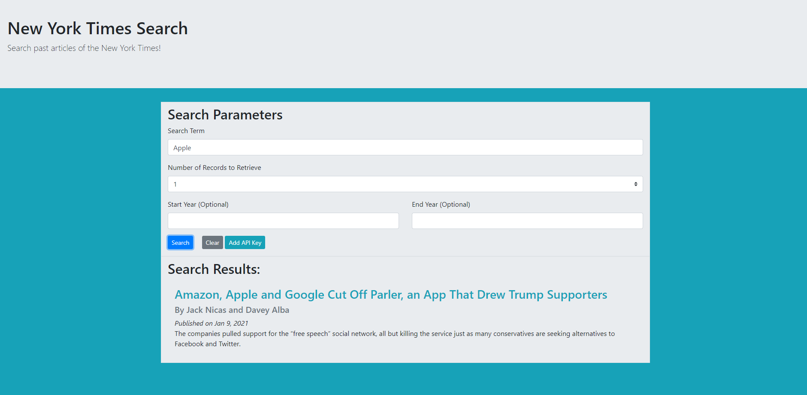

# New York Times Article Search
A mini-project designed to create a readable New York Times Article Browser using jQuery, ajax, and the NYTimes API.

[Deployment](https://zekkxx.github.io/new-york-times-app/) || [Repository](https://github.com/zekkxx/new-york-times-app)

Designed by:
[Kieran Anthony](https://github.com/zekkxx),
[Mike Snyder](https://github.com/mikesnyder),
[Ivan Wijetunge](https://github.com/iwijetunge),
[Brian Lynn](https://github.com/Balynn077),
[Jeff Samuels](https://github.com/jeffsamuels)

## Technology:
Primary CSS Source from [Bootstrap](https://getbootstrap.com/). API from [The New York Times Developer Network](https://developer.nytimes.com/). This project utilizes jQuery and Ajax for requests. This project also stores information to localStorage on the browser.

## Utilization:

In order to use this project, you will need to have an API Key from the New York Times API. You can input this key using the button labeled as `Add API Key`. This will store the key to localMemory for future reference. You can check to see what API Key is currently applied by using the same button and reading the API Key that displays.

Searching works similarly to searching for results on google. Place a search term in the appropriate field, and then decide how many results max, up to 10, you want to recieve. You can choose to narrow your search results to a specific set of years using the `Start Year` and `End Year` fields. When you are ready, click on the `Search` button and the page will then inform you of your results and scroll down to highlight the articles found for you.

You can jump directly to the article on the New York Time's website by clicking on the title when the results are presented to you. Or you can continue to search according to the life of your API Key.
